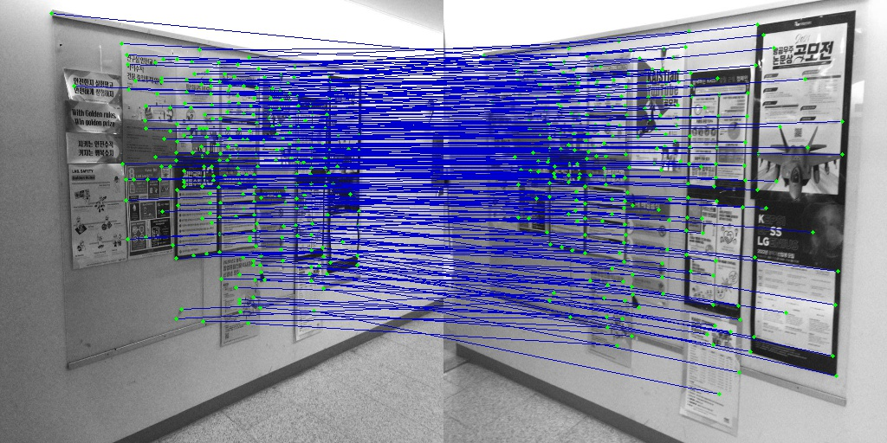
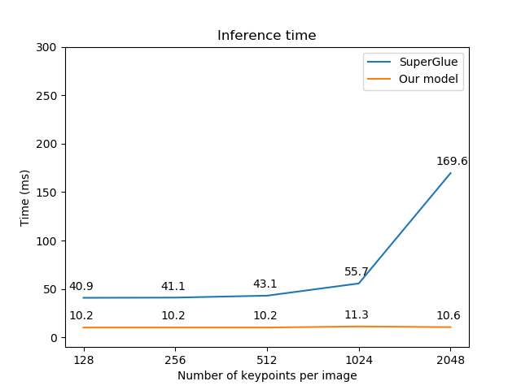

# Fast Feature Matching with Linear Transformers

Implementation of Fast Feature Matching with Linear Transformers with Pytorch
Fast and memmory eficient 

## How to use
### Image matching

For image matching run:

- python demo_2_im.py  -v --image1_path= path_to_im1  --image2_path= path_to_im2
- python demo_2_im.py  -v --image1_path='./media/im1.jpg'  --image2_path='./media/im2.jpg' (exampe)

The resulting image will be saved in ./result

Result:

### Video demo

For video-image matching run:
- python demo_video.py  --video_path=path --image_path=path
- python demo_video.py  --video_path='./media/vid_car.MOV' --image_path='./media/ref_car.jpg' (exampe) 

If you want to incude visualization of matching : 
- python demo_video.py -v --video_path=path --image_path=path

The resulting video will be saved in ./result

## Comprising with SuperGlue

| Number of keypoints per image | SuperGlue inference time (ms) | Our model inference time (ms) |
| :--- | :--- | :--- |
| 128 | 41.1 | 10.1|
| 256 | 41.0 | 10.2|
| 512 | 43.1 | 10.2|
| 1024 | 55.7 | 10.3|
| 2048 | 169.6 | 35.4|
| 512 CPU | 180.5 | 35.4|

